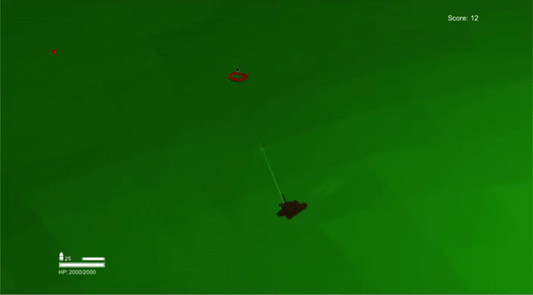

This was a simple unity based game I made to learn about Unity for a UROP project in my second year of university. Optimised the code slightly here, and then pushed it to Github for Posterity. It's a simple arena based shooter, and you drive a tank around, trying to survive as long as possible as more and more enemies swarm you. 

In addition to unity, I also learned about making 3D models in blender, unwrapping of models and texturing.

  

